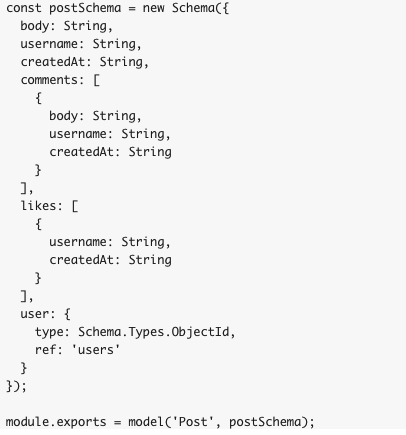
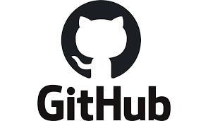

<h1>kurakani<h1>
<h3>Description</h3>

Kurakani is an app designed to users who wants to write something or what is in their mind .Freedom to express in their own words and share that to other and get feedback and reactions on that though is how this app work.

 
<h3>User Stories</h3>

<h4>MVP:</h4>
<ul>
<li>As a user , I want to be able to view a Homepage for the site.
<li>As a user,I want to be able to Register for a account.
<li>As a user,I want to Login to view all the my saved information.
<li>As a user,I want to be able to logout when I am done using the site, but have the information saved  in the database.
<li>As a user,I want to be able to Access my personal information on an account page , and change if its necessary.
 
<li>As a user, I want to create a post 
<li>As a user,I want to delete the post.
<li>As a user, I want to share the post of other users.
<li>As a user,I want to comment in thet post.
<li>As a user , I want to like or dislike the post or comments in the post.
<li>As a user ,I want to interact with other users.
<li>As a user,I want to send direct message to other users.
</ul>

<h3>STRETCH GOALS:</h3>
<ul>
<li>As a user,I want to chat with other user 
<li>As a user, I want to add more styles and attractive
<li>As a user,I want to access a calendar in my main page.
<li>As a user, I want to select the relevent post appears in my main page.
<li>As a user , I want to link my events or any post to other social app available in the market,
<li>As a user , I want to post image,videos and calendar.

<h3>Sprints</h3>
<ul>
<ul>Monday
<li>Set up App folder / file structure</li>
<li>Install all npm packages</li>
<li>Set up express and mongo, require all packages</li>
<li>Create full component/controller list</li>
<li>Build out boilerplate for each app file</li>
<li>Stub out all routes</li>
</ul>

<ul>Tuesday
<li>Saved route folder in Postman</li>
<li>Work on basic stylesheet setup / work with bootstrap
</li>
<li>Run db testing on each route</li>
<li>Build out all routes</li>
<li>Build all components</li>

<ul>Wednesday

<li>Plug in all HTML copy into react components</li>
</ul>

<ul>Thursday
<li>MVP</li>
</ul>

<h3> Database Schema</h3>
 

 

<h3>Technologies</h3>
<h4>Technologies used for app:</h4>
<ol>
<li>React framework (manipulate the DOM based on application data and response to user interaction)</li>
<li>Express.js, Node.js,GraphQl (manage routes, handling requests and views)</li>
<li>Mongoose (create all necessary for project models)</li>
<li>MongoDB (save and store users: authorization info, trips, expenses, checklists etc)</li>
<li>Axios (pull up backend and API’s data)</li>
<li>Dotenv package (hide/ store secret important information)</li>
<li>Rowdy-logger (help to visualize routes)</li>
<li>Socket io enables realtime, bi-directional communication between web clients and servers</li>

<h3>Wireframe</h3>

 

 

 

<h3>For Code click on link</h3>

# P4-client
